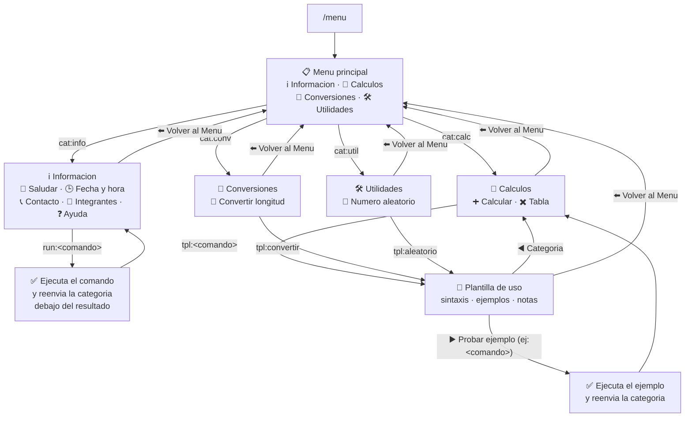

# Bot de Telegram - Tarea 03

Bot interactivo de Telegram desarrollado en **Python** con la libreria
`python-telegram-bot`. Permite la interaccion mediante comandos con parametros,
un menu interactivo con botones y manejo controlado de entradas invalidas.

Universidad de San Carlos de Guatemala - Facultad de Ingenieria
Escuela de Ingenieria en Ciencias y Sistemas - Inteligencia Artificial 1

## Integrantes

| Nombre | Carnet |
|---|---|
| Evelio Marcos Josue Cruz Solliz | 202010040 |
| Andrés Alejandro Agosto Méndez | 202113580 |
| Daniel Hernandez | 202300512 |
| Jose Emanuel Monzon Lemus | 202300539 |
| Angel Geovanny Ordón Colchaj | 201905741 |

## Enlace del grupo de Telegram

_(pendiente: colocar el enlace del grupo o chat de Telegram)_

## Instalacion y ejecucion local

1. Clonar el repositorio y entrar a la carpeta de la tarea:

   ```bash
   git clone <url-del-repositorio>
   cd IA1_Tareas_2S2026_SECA/Tarea3
   ```

2. Crear y activar un entorno virtual:

   ```bash
   python -m venv venv
   # Windows
   venv\Scripts\activate
   # Linux / macOS
   source venv/bin/activate
   ```

3. Instalar las dependencias:

   ```bash
   pip install -r requirements.txt
   ```

4. Configurar las variables de entorno. Copie la plantilla y coloque el token
   entregado por BotFather:

   ```bash
   cp .env.example .env
   ```

   El archivo `.env` esta incluido en `.gitignore`, por lo que el token nunca se
   sube al repositorio.

5. Ejecutar el bot:

   ```bash
   python main.py
   ```

## Comandos implementados

| Comando | Descripcion |
|---|---|
| `/hola` | Saluda al usuario utilizando su nombre de Telegram. |
| `/hora` | Muestra la fecha y hora actual obtenida dinamicamente. |
| `/contacto` | Muestra la informacion de contacto del grupo. |
| `/integrantes` | Muestra el nombre y carnet de los integrantes. |
| `/ayuda` | Lista los comandos disponibles con su descripcion. |
| `/menu` | Despliega el menu interactivo con botones de Telegram. |
| `/calcular <n1> <operador> <n2>` | Suma, resta, multiplicacion y division. Ej: `/calcular 15 + 3` |
| `/tabla <numero>` | Tabla de multiplicar del 1 al 10. Ej: `/tabla 7` |
| `/convertir <cantidad> <origen> <destino>` | Conversion entre `cm`, `m`, `km`, `mi` y `ft`. Ej: `/convertir 5 km mi` |
| `/aleatorio <min> <max>` | Numero entero aleatorio en el rango indicado. Ej: `/aleatorio 1 100` |

Ante un comando inexistente, parametros faltantes o valores invalidos, el bot
responde con un mensaje que indica el error y la sintaxis correcta, sin
detener su ejecucion.

## Menu interactivo (`/menu`)

El comando `/menu` despliega un menu de botones (`InlineKeyboardMarkup`)
organizado en cuatro categorias. Toda la navegacion ocurre **sobre el mismo
mensaje**: al presionar un boton el bot edita el texto y el teclado en lugar
de enviar mensajes nuevos, y cada pantalla incluye el boton
**"⬅️ Volver al Menú"** para regresar al menu principal.

Al presionar un comando ocurre una de dos cosas segun el tipo de comando:

| Tipo de comando | Categoria | Accion al presionar el boton |
|---|---|---|
| Sin parametros (`/hola`, `/hora`, `/contacto`, `/integrantes`, `/ayuda`) | ℹ️ Informacion | Se **ejecuta directamente**. El resultado llega como mensaje nuevo y el menu de la categoria se vuelve a enviar debajo para seguir navegando. |
| Con parametros (`/calcular`, `/tabla`, `/convertir`, `/aleatorio`) | 🧮 Calculos, 📐 Conversiones, 🛠️ Utilidades | Se muestra una **plantilla de uso** con la sintaxis, ejemplos y notas. Incluye el boton **"▶️ Probar ejemplo"**, que ejecuta el comando con los valores del primer ejemplo. |

### Diagrama del flujo de navegacion



Cada boton lleva un `callback_data` corto que `manejar_boton` interpreta:

| `callback_data` | Pantalla o accion |
|---|---|
| `menu` | Menu principal. |
| `cat:<clave>` | Pantalla de la categoria (`info`, `calc`, `conv`, `util`). |
| `run:<comando>` | Ejecuta un comando sin parametros. |
| `tpl:<comando>` | Muestra la plantilla de uso de un comando con parametros. |
| `ej:<comando>` | Ejecuta el comando con los argumentos del primer ejemplo. |

Un `callback_data` desconocido (por ejemplo, de un boton de una version
anterior del bot) regresa al menu principal en lugar de generar un error, y si
el mensaje del menu es demasiado antiguo para editarse se envia un menu nuevo.

## Estructura del proyecto

```
Tarea3/
├── main.py                       # Punto de entrada y registro de handlers
├── config/
│   └── settings.py               # Carga y validacion de variables de entorno
├── handlers/
│   ├── informativos.py           # /hola /hora /contacto /integrantes /ayuda
│   ├── menu.py                   # /menu y callbacks de los botones
│   ├── matematicas.py            # Logica pura de calculo (sin Telegram)
│   ├── comandos_matematicas.py   # Adaptador de Telegram para /calcular y /tabla
│   ├── utilidades.py             # /convertir y /aleatorio
│   └── global_handler.py         # Comandos inexistentes y manejo de errores
├── requirements.txt
├── .env.example
├── Dockerfile
└── fly.toml
```

La logica de negocio se mantiene separada de la libreria de Telegram, lo que
permite probar los calculos de forma local:

```bash
python handlers/matematicas.py
```

## Despliegue en la nube (Fly.io)

El bot se despliega en **Fly.io** como un proceso permanente que utiliza
`polling`, por lo que no expone puertos HTTP ni requiere webhook.

### Requisitos

Instalar la CLI de Fly (`flyctl`):

```powershell
# Windows (PowerShell)
iwr https://fly.io/install.ps1 -useb | iex
```

```bash
# Linux / macOS
curl -L https://fly.io/install.sh | sh
```

### Pasos

1. Iniciar sesion:

   ```bash
   fly auth login
   ```

2. Desde la carpeta `Tarea3`, crear la aplicacion sin desplegarla aun.
   Si el nombre ya esta ocupado, elija otro y actualicelo en `fly.toml`:

   ```bash
   cd Tarea3
   fly launch --no-deploy --copy-config --name bot-telegram-tarea3
   ```

3. Cargar el token como *secret*. Nunca se coloca en el codigo ni en `fly.toml`:

   ```bash
   fly secrets set TELEGRAM_TOKEN=el_token_de_botfather
   ```

4. Desplegar:

   ```bash
   fly deploy
   ```

5. Verificar que el bot quedo activo:

   ```bash
   fly status
   fly logs
   ```

### Mantener el bot activo

El archivo `fly.toml` no define servicios HTTP, por lo que la maquina no se
suspende por inactividad de red y el bot permanece ejecutandose de forma
continua.

Comandos utiles durante el periodo de calificacion:

| Accion | Comando |
|---|---|
| Ver estado de la maquina | `fly status` |
| Ver logs en tiempo real | `fly logs` |
| Reiniciar el bot | `fly apps restart bot-telegram-tarea3` |
| Redesplegar tras un cambio | `fly deploy` |
| Listar las variables cargadas | `fly secrets list` |

Si el bot deja de responder, `fly logs` muestra la causa y
`fly apps restart` lo levanta nuevamente.

## Detalle de qué integrante realizó cada parte de la tarea

### Integrante 1: Arquitectura Base, Despliegue y Control Global
* **Responsable:** Evelio Marcos Josue Cruz Solliz (202010040)
* **Aportes:**
  * Estructura base modular del proyecto (`main.py`, `config/`, `handlers/`).
  * Creacion del bot en BotFather, obtencion del token y registro de la lista de
    comandos visible en Telegram (`set_my_commands`).
  * Manejador global de comandos inexistentes y mensajes de texto no reconocidos.
  * Manejador global de excepciones, que impide que un fallo detenga el bot.
  * Gestion de variables de entorno con `.env`, `.env.example` y `.gitignore`.
  * Definicion de `requirements.txt` con las dependencias del proyecto.
  * Adaptador de Telegram para el modulo matematico (`comandos_matematicas.py`).
  * Configuracion del despliegue en la nube (`Dockerfile`, `fly.toml`) y
    monitoreo de disponibilidad del bot.

### Integrante 2: Comandos Informativos y Datos del Grupo
* **Responsable:** _(pendiente)_
* **Comandos:** `/hola`, `/hora`, `/contacto`, `/integrantes`, `/ayuda`.

### Integrante 3: Menú Interactivo (Botones de Telegram)
* **Responsable:** Daniel Hernandez (202300512)
* **Comandos:** `/menu` y los manejadores de eventos de los botones
  (`handlers/menu.py`).
* **Aportes:**
  * Menu principal con `InlineKeyboardMarkup` y navegacion por categorias:
    Informacion, Calculos, Conversiones y Utilidades.
  * `CallbackQueryHandler` (`manejar_boton`) que despacha cada boton segun su
    `callback_data`: ejecuta el comando (sin parametros), muestra la plantilla
    de uso (con parametros) o ejecuta el ejemplo de la plantilla.
  * Boton "⬅️ Volver al Menú" en todas las pantallas y boton para regresar a la
    categoria desde las plantillas.
  * Adaptador `_UpdateDesdeBoton` que permite reutilizar los handlers de los
    demas integrantes desde un boton sin modificar sus modulos.
  * Manejo de casos borde: mismo boton presionado dos veces, `callback_data`
    desconocido y mensajes de menu que Telegram ya no permite editar.
  * Definicion declarativa del menu (`OPCIONES` y `CATEGORIAS`), por lo que
    agregar un comando nuevo al menu solo requiere una entrada en el
    diccionario.
  * Documentacion del flujo de navegacion (seccion "Menu interactivo").

### Integrante 4: Modulo Matematico
* **Responsable:** José Emanuel Monzén Lémus (202300539)
* **Comandos implementados:**
  * `/calcular <numero1> <operador> <numero2>`: Evaluacion aritmetica de suma, resta, multiplicacion y division.
  * `/tabla <numero>`: Generacion de tabla de multiplicar del 1 al 10.
* **Validaciones y robustez aplicadas:**
  * Validacion estricta de cantidad de argumentos (rechaza parametros insuficientes o en exceso con sintaxis esperada).
  * Validacion de tipos numericos para operandos tanto enteros como de punto flotante.
  * Validacion de operadores aritmeticos admitidos (`+`, `-`, `*`, `x`, `X`, `/`).
  * Prevencion y control estricto de indeterminacion por division entre cero (`ZeroDivisionError`).
  * Mensajes de respuesta claros indicando el tipo de error y ejemplos de sintaxis correcta de acuerdo con las especificaciones.
  * Desacoplamiento total: funciones generales independientes de la libreria de Telegram con suite de pruebas unitarias locales.

### Integrante 5: Conversiones de Longitud y Números Aleatorios
* **Responsable:** _(pendiente)_
* **Comandos:** `/convertir`, `/aleatorio`.
